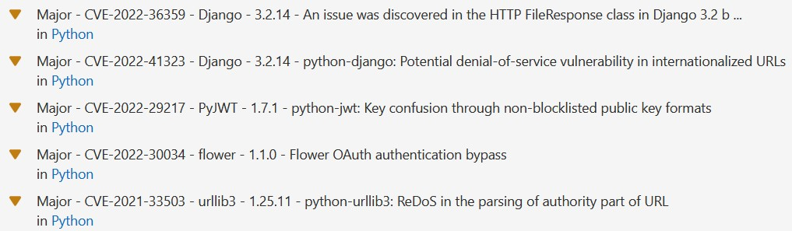

# Motivation
The included gitlab container scanning only scans docker images and can't read lockfiles.  
To fix this, you need to run a Trivy instance yourself and tell it to scan the filesystem instead.  

This config template can be included in your `.gitlab-ci.yml` to get the scanning job for free (similar to how the gitlab container scanning thing works).

## Setup instructions
At the very top of your .gitlab-ci.yml either add or expand the `include:` section so it looks similar to this:  
```yaml
include:
  - project: 'circle-tech-evangelists/security-checks'
    file: 'security-checks.yaml'
  # There might be more includes here, usually starting with template like the following:
  # - template: 'Workflows/Branch-Pipelines.gitlab-ci.yml'
```

You will also need to have at least one stage called test in your top-level stages config for the default configuration:  
```yaml
stages:
  - prebuild
  - build
  - test
  - posttest
  - deploy
```  
**The `test` stage has to come after the docker image has already been built and pushed to the registry or the scanner will not work.**

Last but not least you need a job within that test stage going by the name `container_scanning`. A minimal config looks like this:  
```yaml
container_scanning:
  variables:
    IMAGE: $IMAGE_TAG_BACKEND
    DIRECTORY: "backend"
```

The example shown here will overwrite the `container_scanning` job from the template and tell it to a) scan an image as specified in the `IMAGE_TAG_BACKEND` variable, b) also scan the filesystem in a directory called frontend and c) only report errors with a level of HIGH or CRITICAL

## Scanning multiple images/directories (i.e. frontend and backend)  
To scan multiple images/directories, you can simply copy the job above, add another key `extends: container_scanning` and change the variable values for the other container.

Here's an example:
```yaml
container_scanning_frontend:
  extends:
    - container_scanning
  variables:
    IMAGE: $IMAGE_TAG_FRONTEND
    DIRECTORY: "frontend"
```

## Show reports in the Merge-Request UI
To show a report-widget with all the errors found in the Merge-Request widget, you need to a) set `allow_failure: true` in your scanning jobs and b) create another job to run in one of the following stages (can be an own stage or you can reuse one of your existing stages).  
This secondary job will then read the report files from your scanning jobs, combine them and report them as code-quality to GitLab.  
Here's an example of how that job could look like:  
```yaml
check security scan results:
  stage: posttest
  image: ${CI_DEPENDENCY_PROXY_GROUP_IMAGE_PREFIX}/alpine:latest
  dependencies:
    - container_scanning
    # List all your container scanning jobs here, one per line
    # - container_scanning_frontend
  tags:
    - low-load
  before_script:
    - apk update && apk add jq coreutils grep
  script:
    - echo "Step 1: Merge all codeclimate reports from scanning jobs"
    - jq -s 'add' gl-codeclimate-*.json > gl-codeclimate.json
    - echo "Step 2: Check if there were any vulnerabilities and exit with a status code equal to the number of vulnerabilities"
    - jq '.[].type' .\gl-codeclimate.json | grep "issue" | exit $(wc -l)
  # Enables https://docs.gitlab.com/ee/user/application_security/container_scanning/ (Container Scanning report is available on GitLab EE Ultimate or GitLab.com Gold)
  artifacts:
    paths:
      - gl-codeclimate.json
    reports:
      codequality: gl-codeclimate.json
```

If all is good, you'll see a new green bar above your test results.  
If any vulnerabilities were found, you'll see a new yellow bar above the test results in your Merge-Request:  
  
You can then expand that section and see all the results:  
  


You can also just check the failed scanning jobs for a plaintext error report. This can also include additional details not visible in the GitLab-UI.  
For JavaScript vulnerabilities found in a package-lock.json, it will also report the whole dependency tree to find which package caused the vulnerable version to be included in your project. (This sadly doesn't work for yarn.lock or pnpm-lock.yaml at the moment)  

## Advanced Settings  
The container scanning job exposes a few more variables by which you can adjust the scanning if needed. The default settings are the recommendation of the TE-Circle, though.  

### Change minimum severity reported
By adding a new variable called `SEVERITY` to your job, you can change which severity items should be reported. The default is to report HIGH and CRITICAL vulnerabilities. The remaining options are: `UNKNOWN`, `LOW`, `MEDIUM`  
Trivy requires a full list of severities to report. To report all severities from MEDIUM and higher for example, you need to specify a comma-separated list like so: `SEVERITY: "MEDIUM,HIGH,CRITICAL"`

### Other settings
By default trivy performs one run in full-silence mode writing the results to the gitlab codeclimate report file and then another one showing the results in a plaintext table. If the scan is taking very long, you can also show a progress bar during the scan by setting the `TRIVY_NO_PROGRESS` variable to `"false"`.  
To make sure you're doing a fresh run and instruct trivy to download a fresh vulnerability database, you can turn off/move the cache directory via the `TRIVY_CACHE_DIR` variable. The default value for this variable is a directory called `.trivycache`

You can add more variables corresponding to the CLI switches as documented on the trivy homepage: https://aquasecurity.github.io/trivy/latest/docs/references/customization/envs/

Last, but not least, you can set up a .trivyignore file in your project's root directory and enter one CVE-ID per line to ignore that specific vulnerability. 
